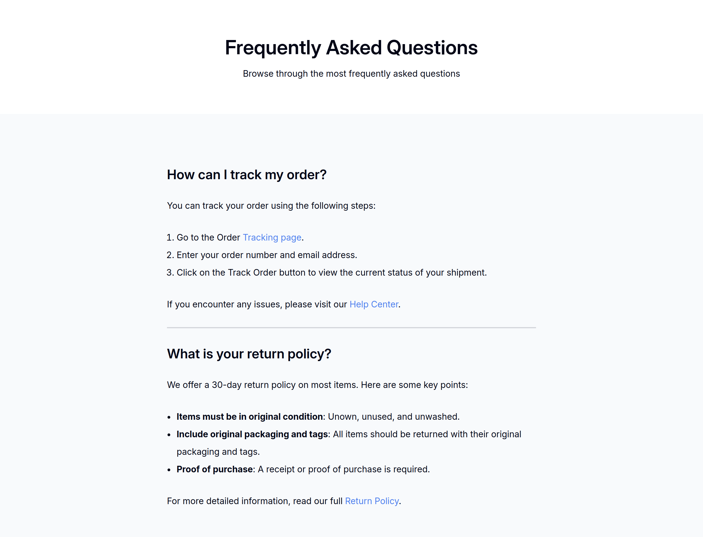

# Simple FAQ

This is a small project I made to train with HTML and CSS

## Table of Content

  - [Overview](#overview)
    - [Description](#description)
    - [Screenshot](#screenshot)
    - [Links](#links)
  - [My process](#my-process)
    - [Built with](#built-with)
    - [What I learned](#what-i-learned)
    - [Continued Development](#continued-development)
    - [Useful Resources](#useful-resources)
  - [Author](#author)
  - [Acknowledgments](#acknowledgments)

## Overview

### Description

I present to you a small project I made. The main objective was to work with HTML and CSS to perfect my knowledge with those technologies.
It consist of a simple FAQ webpage containing a header and a main with two sections, each answer a question.
This project works on all device, from smartphone to desktop computer !

### Screenshot



### Links

  - [Live Site](https://sephydev.github.io/simple-faq/)

## My process

### Built with

  - Semantic HTML5
  - CSS

### What I learned

Thanks to this project, I've practiced some semantic HTML and CSS. The following snippets are some examples of the knowledges I used.

  - Semantic HTML5 (```<ol>```):

```
        <ol>
          <li>Go to the Order <a href="#">Tracking page</a>.</li>
          <li>Enter your order number and email address.</li>
          <li>Click on the Track Order button to view the current status of your shipment.</li>
        </ol>
```

  - CSS (```<ol>, <ul>```):
```
ol, ul {
  padding-left: 1.1rem;
  line-height: 2rem;
}
```

### Continued Development

Seeing how simple it is to use and style list, I will continue to master those techniques in other projects.

### Useful Resources

  - [Guide to HTML List](https://www.w3schools.com/html/html_lists.asp)

## Author

  - Website : Sephydev

## Acknowledgment

Thanks to my friends and my family for supporting me while I journey in the land of Web Development, and during the making of this project !